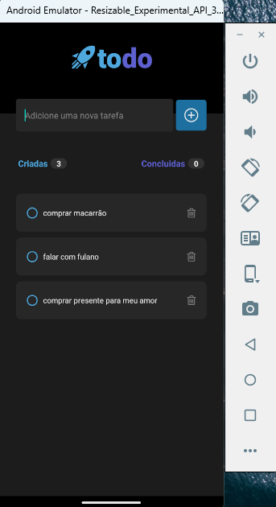

# Desafio 01 - Praticando os conceitos do React Native

esse projeto vem do desafio da rocketSeat da trilha de react-native

## Sobre o Desafio
Nesse desafio, você vai desenvolver uma aplicação de controle de tarefas no estilo **to-do list**, que contém as seguintes funcionalidades:

- Adicionar uma nova tarefa
- Marcar e desmarcar uma tarefa como concluída
- Remover uma tarefa da listagem
- Mostrar o progresso de conclusão das tarefas

## Layout do Projeto
  

## Meu Projeto

### primeira tela
  

### tela marcando tarefa como concluida
  

### Tela com tarefas adicionadas
  

### excluido tarefa
  

